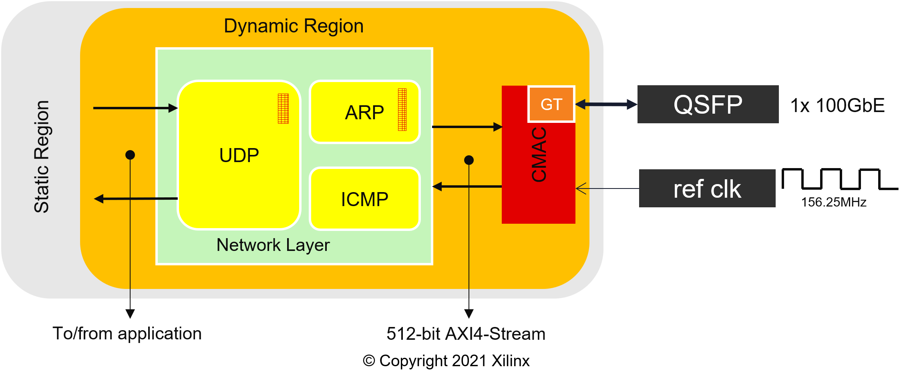
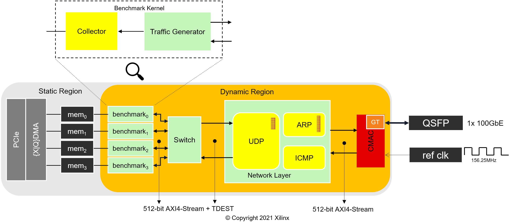

# XUP Vitis Network Example (VNx)

This repository contains IP that you can use to add 100 Gbit/s networking to your Vitis designs. UDP is used as the transport protocol, and allows you to connect your Alveo card to other network equipment or Alveo cards. 

Design examples are provided that show you how to integrate this IP into your Vitis design. One example shows you how to benchmark the network connection and the another shows you how to move data from the host to the network and vice versa. 

The provided IP can be used with any Alveo shell that exposes the QSFP28 Gigabit Transceiver (GT) pins to the dynamic region, [see supported platforms below](#alveo-cards). To find out more check out [Designing a Transceiver-based Application with Vitis](https://developer.xilinx.com/en/articles/designing-a-transceiver-based-application-with-vitus.html).

This repository provides: 

* Source code for the common network infrastructure with UDP support
* Scripts to compile and link the kernels
* Out-of-the-box applications that uses UDP as transport protocol (`basic` and `benchmark`)
* `pynq` host code and helper functions
* DASK integration for multiple FPGAs configuration and task scheduling

## Clone this repository

Build the examples by cloning the repository.

```sh
git clone https://github.com/Xilinx/xup_vitis_network_example.git --recursive
```

## Common infrastructure

This section provides a brief overview of the common infrastructure needed for the examples to work. The examples rely on the same underlying infrastructure, which is `cmac` and `network_layer` kernels.



> **_NOTE:_** the reference clock frequency can change depending on the Alveo card.

### CMAC kernel

The `cmac_kernel` contains an UltraScale+ Integrated 100G Ethernet Subsystem. This kernel is configured according to the `INTERFACE` and `DEVICE` arguments passed to make. It exposes two 512-bit AXI4-Stream interfaces (S_AXIS and M_AXIS) to the user logic, which run at the same frequency as the kernel, internally it has CDC (clock domain crossing) logic to convert from kernel clock to the 100G Ethernet Subsystem clock. It also provides and AXI4-Lite interface to check *cmac* statistics.

### Network Layer kernel

The network layer kernel is a collection of HLS modules to provide basic network functionality. It exposes two 512-bit (with 16-bit TDEST) AXI4-Stream to the application, S_AXIS_sk2nl and M_AXIS_nl2sk.

The ARP table is readable from the host side, and the UDP table is configurable from the host as well. Helper functions to read and configure the tables are available in [Notebooks/vnx_utils.py](Notebooks/vnx_utils.py).

The application communicates with the UDP module using *S_AXIS_sk2nl* and *M_AXIS_nl2sk* AXI4-Stream interfaces with the following structure:

```C
struct my_axis_udp {
  ap_uint<512>    data;
  ap_uint< 64>    keep;
  ap_uint< 16>    dest;
  ap_uint<  1>    last;
}
```

In the Rx path, the network layer provides additional metadata in the user signal. To find out more about this kernel check out [NetLayers/README.md](NetLayers/README.md)

## Examples

### Basic

The following figure depicts the different kernels and their interconnection in the Vitis project for the basic example.


> **_NOTE:_** the reference clock frequency can change depending on the Alveo card.

*cmac* and *network layer* kernels are explained in the section above. In this example the application is split into two kernels, memory mapped to stream (mm2s) and stream to memory mapped (s2mm).

* [mm2s](Kernels/src/krnl_mm2s.cpp): pulls data from global memory and converts it to a 512-bit stream. It chunks the data into 1408-Byte packets, meaning that *last* is asserted. It also asserts *last* when there is no more data to send. The *dest* is set according to the argument with the same name.

* [s2mm](Kernels/src/krnl_s2mm.cpp): gets payload from the UDP module and push the payload to global memory. *dest* and *last* are ignored in this module.

The current limitation of this *application* is that the size of the data must be multiple of 64-Byte to work properly.

Check out [vnx-basic](Notebooks/vnx-basic.ipynb) notebook to see how to run this example using `pynq`.

### Benchmark

The following figure depicts the benchmark design, which contains four *benchmark* kernels. Each benchmark kernel has two modules, traffic generator and collector



> **_NOTE:_** the reference clock frequency can change depending on the Alveo card.

More information about the benchmark kernel in [Benchmark_kernel/README.md](Benchmark_kernel/README.md)

The following notebooks demonstrate how to use the benchmark design to measure throughput and latency either point to point or with a switch connection between two Alveo cards.

* [vnx-benchmark-throughput](Notebooks/vnx-benchmark-throughput.ipynb) 
* [vnx-benchmark-throughput-switch](Notebooks/vnx-benchmark-throughput-switch.ipynb)
* [vnx-benchmark-rtt](Notebooks/vnx-benchmark-rtt.ipynb)
* [vnx-benchmark-rtt-switch](Notebooks/vnx-benchmark-rtt-switch.ipynb)

## Support

### Tools

| Vitis  | XRT       |
|--------|-----------|
| 2020.1 | 2.6.655   |

### Alveo Cards

| Alveo | Development Target Platform(s) | Notes |
|-------|----------|------|
| U50   | xilinx_u50_gen3x16_xdma_201920_3 | |
| U200  | xilinx_u200_gen3x16_xdma_1_202110_1  | See [#28](https://github.com/Xilinx/xup_vitis_network_example/issues/28) | 
| U250  | xilinx_u250_gen3x16_xdma_3.1_202020_1  | See [#16](https://github.com/Xilinx/xup_vitis_network_example/issues/16) | 
| U280  | xilinx_u280_xdma_201920_3 | |

### Requirements

In order to generate this design you will need a valid [UltraScale+ Integrated 100G Ethernet Subsystem](https://www.xilinx.com/products/intellectual-property/cmac_usplus.html) license set up in Vivado.

## Generate XCLBIN

To implement any of the examples run:

```sh
make all DEVICE=<full platform path> INTERFACE=<interface number> DESIGN=<design name>
```

* `DEVICE` Alveo development target platform, [see supported platforms](#alveo-cards)
* `INTERFACE` defines which physical interface is going to be use. 0, 1 or 3 are supported. When `INTERFACE=3` the design will be replicated for each interface. Note that Alveo U50 only has one interface available (`INTERFACE=0`)
* `DESIGN` only support the following strings `basic` and `benchmark`. If you use something different, an error will be reported
* The basic configuration file is pulled from [config_files](config_files) folder and complete with `userPostSysLinkOverlayTcl` parameter before calling `v++`.
* [post_sys_link.tcl](post_sys_link.tcl) is automatically called from `v++` after system link. It is used to connect the GT capable pins to the cmac kernel(s)
* The `XCLBIN` will be generated in the folder \<DESIGN\>.intf_\<INTERFACE\>.\<(short)DEVICE\>


## Repository structure

~~~
├── Basic_kernels
│   └── src
├── Benchmark_kernel
│   └── src
├── config_files
├── Ethernet
│   └── cmac
├── img
├── NetLayers
│   ├── 100G-fpga-network-stack-core
│   └── src
└── Notebooks
~~~

* Basic_kernels: this folder contains the code for the basic application (*mm2s* and *s2mm*)
* Benchmark_kernel: this folder contains the benchmark application, which includes the collector, traffic generator and switch kernels
* config_files: this folder contains the different configuration files for the different examples and flavors
* Ethernet: this folder contains the logic to generate the *cmac* kernel for the different Alveo cards and interfaces
* img: this folder contains images 
* NetLayers: this folder contains the logic to generate the *network\_layer* kernel, using the submodule `100G-fpga-network-stack-core`
* Notebooks: this folder contains companion Jupyter notebooks to show how to run the different examples

## Licenses

**Vitis Network Example (VNx)** License [BSD 3-Clause License](LICENSE.md)

**Ethernet/cmac** License: [BSD 3-Clause License](THIRD_PARTY_LIC.md)

**NetLayers/100G-fpga-network-stack-core** License: [BSD 3-Clause License](THIRD_PARTY_LIC.md)

## Pitfall

VXx **IS NOT** a Network Interface Card (NIC). VNx main goal is to provide networking offload to Vitis kernels, so these kernels can communicate from one Alveo card to another without spending CPU cycles and minimum communication latency.

If you are interested in a NIC design, please check out [OpenNIC Platform](https://github.com/Xilinx/open-nic)

------------------------------------------------------
<p align="center">Copyright&copy; 2021 Xilinx</p>
